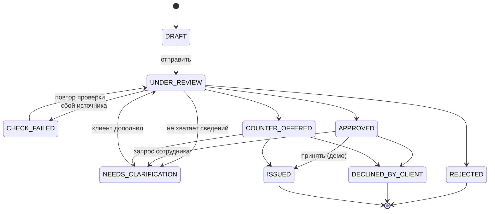

# state-diagram

Состояния заявки (`ApplicationStatus` в backend):

```mermaid
stateDiagram-v2
    [*] --> DRAFT
    DRAFT --> UNDER_REVIEW: отправить
    UNDER_REVIEW --> NEEDS_CLARIFICATION: не хватает сведений
    UNDER_REVIEW --> CHECK_FAILED: сбой источника
    UNDER_REVIEW --> APPROVED
    UNDER_REVIEW --> COUNTER_OFFERED
    UNDER_REVIEW --> REJECTED
    NEEDS_CLARIFICATION --> UNDER_REVIEW: клиент дополнил
    CHECK_FAILED --> UNDER_REVIEW: повтор проверки
    APPROVED --> ISSUED: принять (демо)
    APPROVED --> DECLINED_BY_CLIENT
    APPROVED --> NEEDS_CLARIFICATION: запрос сотрудника
    COUNTER_OFFERED --> ISSUED
    COUNTER_OFFERED --> DECLINED_BY_CLIENT
    COUNTER_OFFERED --> NEEDS_CLARIFICATION
    REJECTED --> [*]
    DECLINED_BY_CLIENT --> [*]
    ISSUED --> [*]
```
